# Contexto y estado del proyecto Go-Tacna

Documento de referencia para dar continuidad al desarrollo y compartir el contexto del sistema con colaboradores y asistentes de IA. Resume la arquitectura prevista, la infraestructura reportada, los cinco repositorios y el estado conocido; distingue los servicios desplegados de las tareas todavía pendientes.

## 1. Visión general e infraestructura

- **Nombre oficial:** Go-Tacna. Las denominaciones anteriores Capaqñan y RutaTacna ya no se usan para este proyecto.
- **Propósito:** sistema de monitoreo GPS en tiempo real del transporte público de Tacna, Perú. Permite consultar rutas, ubicación de micros y tiempos estimados de llegada (ETA), y administrar la flota.
- **Roles:** Pasajero, Conductor y Administrador. El objetivo funcional es ofrecer acceso desde la web y la aplicación móvil; algunas pantallas y funciones todavía están en desarrollo.
- **Organización de GitHub:** `tuChaski`. El proyecto sigue una estrategia multirrepositorio con cinco repos independientes.

### Datos operativos reportados

| Elemento | Valor / estado |
|---|---|
| Proveedor del VPS | Contabo |
| IPv4 pública | `13.140.174.64` |
| Dominios oficiales | `go-tacna.site` y `www.go-tacna.site` |
| TLS | Certificados Let's Encrypt reportados como activos, con renovación automática mediante Certbot |
| Proxy inverso | Nginx global del host; debe conservar las cabeceras `Upgrade` y `Connection` para WebSockets |
| Firewall UFW | Puertos públicos `80` (HTTP) y `443` (HTTPS) reportados como abiertos |

El proxy global escucha en los puertos públicos `80` y `443`. El gateway de la aplicación debe estar accesible desde el host en `127.0.0.1:8001`; no se deben publicar directamente a Internet la API, el servicio de tiempo real ni PostgreSQL. El enrutamiento al puerto `8001` está relacionado con el error `502 Bad Gateway` pendiente de resolver. Los detalles del patrón de despliegue están en [INFRASTRUCTURE.md](INFRASTRUCTURE.md).

## 2. Stack y arquitectura de software

| Componente | Tecnología | Responsabilidad prevista |
|---|---|---|
| Backend Core (`gotacna-backend-core`) | Laravel 13, PHP 8.3 o superior | API REST, autenticación JWT, autorización por roles (RBAC), operaciones de gestión y lógica de negocio, incluido el ETA |
| Gateway (`gotacna-api-gateway`) | Nginx / proxy de entrada | Recibir el tráfico de la aplicación y dirigirlo a la API, la web y el servicio de tiempo real |
| Servicio de ubicación (`go-tacna-location-service`) | Node.js, Express y Socket.IO | Recibir las coordenadas de los conductores —objetivo de frecuencia: cada 3 a 5 segundos— y distribuir actualizaciones en tiempo real a los clientes |
| Base de datos (`db`) | PostgreSQL 16 + PostGIS | Datos relacionales y geoespaciales; rutas como `LINESTRING` y ubicaciones como `POINT`. Puerto `5432` interno, no público |
| Plataforma web (`go-tacna-frontend`) | React, Vite y Tailwind CSS | Experiencia web responsive para consulta de rutas y operaciones según el rol |
| Aplicación móvil (`go-tacna-movil`) | React Native y Expo | Experiencia móvil multirol, mapa y modo Conductor con envío GPS, incluso en segundo plano cuando esté implementado |

La estimación del ETA se basa en distancia y velocidad y siempre debe presentarse como estimada, no como una hora garantizada. El almacenamiento persistente de las lecturas GPS debe confirmarse contra la implementación del servicio: no se debe asumir que el estado de tiempo real ya se persiste en PostgreSQL hasta completar esa integración.

La documentación, los contratos y las decisiones transversales se mantienen en `go-tacna-docs`. La estructura completa del repositorio se enumera en la siguiente sección.

## 3. Matriz de repositorios y estructura documental

Los cinco repositorios oficiales de GitHub bajo `tuChaski` son:

```text
tuChaski/
├── go-tacna-docs/             # Documentación, contratos, arquitectura e informes
├── go-tacna-backend/          # Gateway, API Laravel y servicio de ubicación
├── go-tacna-frontend/         # Plataforma web
├── go-tacna-infraestructura/  # Compose, despliegue, Nginx y manifiestos futuros
└── go-tacna-movil/            # Aplicación móvil React Native / Expo
```

### `go-tacna-docs`

Repositorio transversal para las especificaciones, la gobernanza y los entregables. Su árbol documental incluye:

| Carpeta | Contenido |
|---|---|
| `arquitectura/` | Arquitectura del sistema, modelo de datos, diagramas técnicos y decisiones |
| `casos-de-uso/` | Diagramas y especificaciones de casos de uso |
| `contratos/` | Contratos OpenAPI, eventos WebSocket y claims JWT |
| `diagramas/` | Fuentes Mermaid y exportaciones de diagramas |
| `diseno/` | Guía visual, mapa del sitio, vistas y referencias de diseño |
| `general/` | Fichas de repositorios, configuración, checklist y decisiones pendientes |
| `requisitos/` | Requisitos funcionales, no funcionales, reglas de negocio y alcance del MVP |
| `planificacion/` | Fases y planificación del proyecto |
| `pruebas/` | Plan de pruebas y matriz de trazabilidad |
| `manuales/` | Guías de usuario y administración |
| `informe/` | Capítulos y entregables del Trabajo Final |
| `guias/` | Guías transversales del equipo |
| `assets/` | Recursos gráficos compartidos |

Los directorios `general/`, `arquitectura/`, `casos-de-uso/`, `contratos/`, `diagramas/` y `diseno/` forman parte explícita de la estructura y no deben sustituirse por una lista parcial.

### `go-tacna-backend`

Contiene tres componentes:

- `gotacna-api-gateway/`: componente destinado al proxy y la entrada a los servicios.
- `gotacna-backend-core/`: núcleo de la API en Laravel.
- `go-tacna-location-service/`: servicio Node.js para recepción y difusión de ubicaciones.

Los directorios de Laravel y el servicio Node.js están inicializados. La presencia de una estructura o dependencias instaladas no implica que toda la lógica de negocio, la persistencia GPS o la integración entre servicios esté terminada.

### Los otros tres repositorios

- **`go-tacna-frontend`:** plataforma web React + Vite. El README del repositorio indica que todavía hay componentes del sistema dentro del monorepo original, por lo que la migración debe considerarse en curso hasta comprobar el contenido actual.
- **`go-tacna-movil`:** aplicación móvil React Native + Expo. El repositorio independiente está creado; la experiencia móvil completa, mapa y GPS en segundo plano siguen siendo trabajo de implementación.
- **`go-tacna-infraestructura`:** destino para Compose, automatización y despliegue. El README registra que los manifiestos K3s/Kustomize/Traefik aún no están incorporados; la configuración Compose y Nginx existente está documentada como procedente del monorepo original.

## 4. Diagrama de arquitectura (Mermaid, nivel de contenedores)

Este diagrama usa Mermaid para que GitHub lo renderice directamente. Representa el flujo público por Nginx del host y el puerto local del gateway; el bloque de servicios muestra el objetivo de despliegue, no afirma que K3s ya esté instalado o que todos los componentes estén integrados.

```mermaid
graph LR
    subgraph Actores["Actores del sistema"]
        pasajero["Pasajero<br/>Consulta rutas, micros y ETA"]
        conductor["Conductor<br/>Transmite GPS y gestiona recorridos"]
        admin["Administrador<br/>Gestiona flota y rutas"]
    end

    subgraph Clientes["Clientes multiplataforma"]
        movil["Aplicación móvil<br/>React Native + Expo"]
        web["Plataforma web<br/>React + Vite"]
    end

    subgraph VPS["VPS Contabo · 13.140.174.64"]
        hostNginx["Nginx global del host<br/>HTTP :80 · HTTPS :443<br/>TLS y proxy WebSocket"]
    end

    subgraph Servicios["Servicios de la aplicación · Compose local / K3s planificado"]
        appGateway["Gateway de go-tacna · Nginx<br/>127.0.0.1:8001:80"]
        backend["Backend Core API<br/>Laravel 13 · JWT · RBAC"]
        realtime["Location Service<br/>Node.js · Express · Socket.IO"]
        frontend["Web pública y panel"]
        db[("PostgreSQL 16 + PostGIS<br/>Puerto interno :5432")]
    end

    pasajero --> movil
    pasajero --> web
    conductor --> movil
    conductor --> web
    admin --> movil
    admin --> web

    movil -->|"HTTPS / WSS"| hostNginx
    web -->|"HTTPS / WSS"| hostNginx
    hostNginx -->|"go-tacna.site / www.go-tacna.site<br/>proxy_pass a loopback"| appGateway

    appGateway -->|"/"| frontend
    appGateway -->|"/api/"| backend
    appGateway -->|"/socket.io/"| realtime

    backend -->|"SQL / PostGIS"| db
    realtime -.->|"Persistencia GPS prevista; integración por confirmar"| db
    realtime -.->|"Validación de JWT / contrato interno por definir"| backend

    classDef actor fill:#08427b,stroke:#073b6f,color:#fff
    classDef client fill:#1168bd,stroke:#0e5296,color:#fff
    classDef service fill:#1168bd,stroke:#0e5296,color:#fff
    classDef database fill:#2b7cff,stroke:#1168bd,color:#fff
    class pasajero,conductor,admin actor
    class movil,web client
    class hostNginx,appGateway,backend,realtime,frontend service
    class db database
```



El listener público TLS y los certificados pertenecen al Nginx global del VPS. El gateway del proyecto debe recibir tráfico en loopback (`127.0.0.1:8001`) y enrutar a servicios privados. Para múltiples proyectos, cada dominio debe apuntar a su propio puerto local y a su propio gateway/Compose.

## 5. Estado y próximos pasos conocidos

1. **Resolver el `502 Bad Gateway`:** comprobar que el gateway del proyecto está levantado y escuchando en el puerto del contenedor esperado, que está publicado como `127.0.0.1:8001`, y que Nginx del host apunta a ese puerto. Validar después la conectividad entre gateway y servicios internos.
2. **Completar el despliegue de infraestructura:** conservar Compose para el entorno local y decidir/implementar por separado los manifiestos K3s previstos. No presentar K3s como infraestructura activa hasta verificar su instalación y despliegue.
3. **Completar la integración de los servicios backend:** definir el contrato interno entre API y servicio de ubicación, y verificar autenticación, WebSocket y persistencia de coordenadas.
4. **Migrar y verificar los componentes independientes:** comparar el contenido de los repos de frontend, móvil e infraestructura con el monorepo original antes de considerar completa la separación.
5. **Mantener los contratos como fuente de verdad:** cambios en API, WebSocket o JWT se documentan primero en `go-tacna-docs/contratos/` y después se implementan en los repos consumidores.

Los dominios, dirección IP, certificados y estado de firewall de la sección 1 son datos operativos reportados para el VPS; confirmar su vigencia antes de realizar cambios en producción. No se incluyen credenciales ni secretos en este documento.
